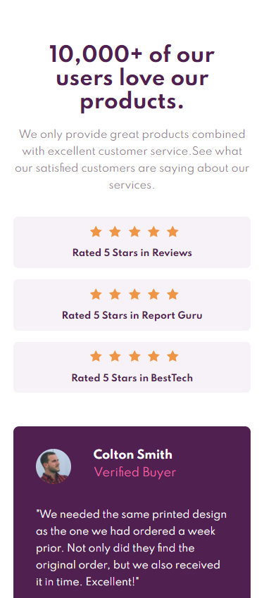
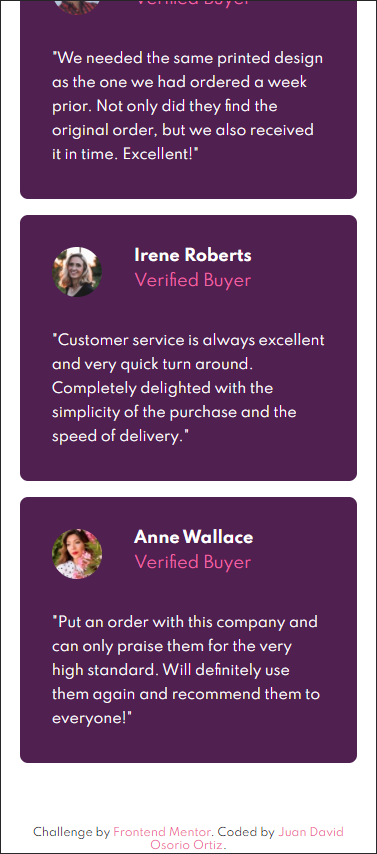
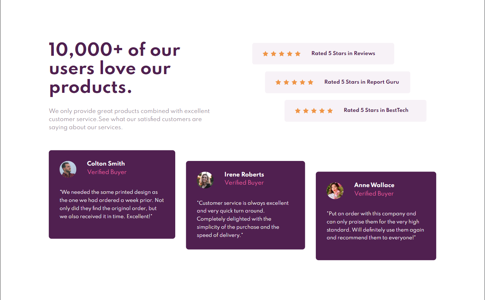

# Frontend Mentor - Social proof section solution

This is a solution to the [Social proof section challenge on Frontend Mentor](https://www.frontendmentor.io/challenges/social-proof-section-6e0qTv_bA). Frontend Mentor challenges help you improve your coding skills by building realistic projects. 

## Table of contents

- [Overview](#overview)
  - [The challenge](#the-challenge)
  - [Screenshot](#screenshot)
  - [Links](#links)
- [My process](#my-process)
  - [Built with](#built-with)
  - [Continued development](#continued-development)
- [Author](#author)

## Overview

### The challenge

Users should be able to:

- View the optimal layout for the section depending on their device's screen size

### Screenshot
**375px**

**1440 px**

### Links

- Solution URL: [https://github.com/JuanDa15/Frontend-Mentor-Challenges/tree/main/social%20proof%20section](https://your-solution-url.com)
- Live Site URL: [https://musing-bartik-68260a.netlify.app](https://your-live-site-url.com)

## My process

### Built with

- Semantic HTML5 markup
- CSS custom properties
- Flexbox
- CSS Grid
- Mobile-first workflow
- SCSS

### Continued development
in the future i want to continue improving the semantic representation of the websites, and i want to optimize the way of applying the media queries in the projects

## Author

- Website - [Github](https://github.com/JuanDa15)
- Frontend Mentor - [@JuanDa15](https://www.frontendmentor.io/profile/JuanDa15)
