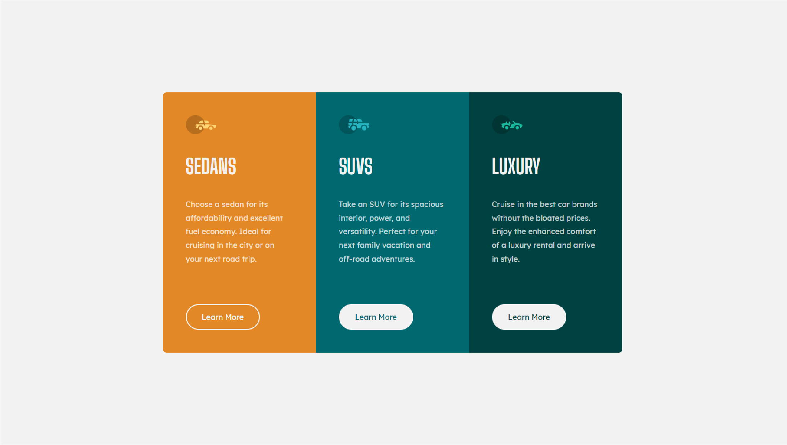

# Frontend Mentor - 3-column preview card component solution

This is a solution to the [3-column preview card component challenge on Frontend Mentor](https://www.frontendmentor.io/challenges/3column-preview-card-component-pH92eAR2-). Frontend Mentor challenges help you improve your coding skills by building realistic projects. 

## Table of contents

- [Overview](#overview)
  - [The challenge](#the-challenge)
  - [Screenshot](#screenshot)
  - [Links](#links)
- [My process](#my-process)
  - [Built with](#built-with)
  - [What I learned](#what-i-learned)
  - [Continued development](#continued-development)
  - [Useful resources](#useful-resources)
- [Author](#author)
- [Acknowledgments](#acknowledgments)

**Note: Delete this note and update the table of contents based on what sections you keep.**

## Overview

### The challenge

Users should be able to:

- View the optimal layout depending on their device's screen size
- See hover states for interactive elements

### Screenshot
**Desktop view**

**Button hover**

**Mobile view**

### Links

- Solution URL: [https://github.com/JuanDa15/Frontend-Mentor-Challenges/tree/main/05%20-%203%20column%20preview%20card](https://github.com/JuanDa15/Frontend-Mentor-Challenges/tree/main/05%20-%203%20column%20preview%20card)
- Live Site URL: [https://lucid-davinci-6e0dcd.netlify.app](https://lucid-davinci-6e0dcd.netlify.app)

## My process

### Built with

- Semantic HTML5 markup
- CSS custom properties
- Flexbox
- Mobile-first workflow

## Author

- Github - [JuanDa15](https://github.com/JuanDa15)
- Frontend Mentor - [@JuanDa15](https://www.frontendmentor.io/profile/JuanDa15)