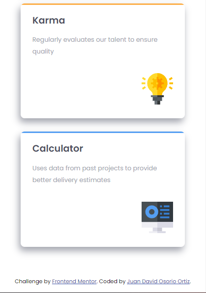

# Frontend Mentor - Testimonials grid section solution

This is a solution to the [Testimonials grid section challenge on Frontend Mentor](https://www.frontendmentor.io/challenges/testimonials-grid-section-Nnw6J7Un7). Frontend Mentor challenges help you improve your coding skills by building realistic projects. 

## Table of contents

- [Overview](#overview)
  - [The challenge](#the-challenge)
  - [Screenshot](#screenshot)
  - [Links](#links)
- [My process](#my-process)
  - [Built with](#built-with)
- [Author](#author)

## Overview

### The challenge

Users should be able to:

- View the optimal layout for the site depending on their device's screen size

### Screenshot

**Desktop view**

**Mobile view**

### Links

- Solution URL: [https://github.com/JuanDa15/Frontend-Mentor-Challenges/tree/main/07%20-%20four%20card%20feature%20section](https://github.com/JuanDa15/Frontend-Mentor-Challenges/tree/main/07%20-%20four%20card%20feature%20section)
- Live Site URL: [https://infallible-wilson-55429b.netlify.app](https://infallible-wilson-55429b.netlify.app)

## My process

### Built with

- Semantic HTML5 markup
- CSS custom properties
- Flexbox
- CSS Grid
- Mobile-first workflow
- SCSS

## Author

- GitHub - [JuanDa15](https://github.com/JuanDa15)
- Frontend Mentor - [@JuanDa15](https://www.frontendmentor.io/profile/JuanDa15)
