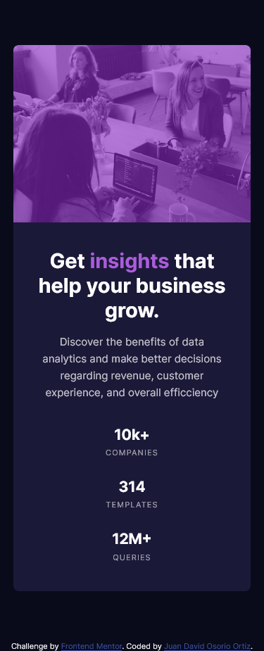

# Frontend Mentor - Stats preview card component solution

This is a solution to the [Stats preview card component challenge on Frontend Mentor](https://www.frontendmentor.io/challenges/stats-preview-card-component-8JqbgoU62). Frontend Mentor challenges help you improve your coding skills by building realistic projects. 

## Table of contents

- [Overview](#overview)
  - [The challenge](#the-challenge)
  - [Screenshot](#screenshot)
  - [Links](#links)
- [My process](#my-process)
  - [Built with](#built-with)
  - [Continued development](#continued-development)
  - [Useful resources](#useful-resources)
- [Author](#author)
- [Acknowledgments](#acknowledgments)

**Note: Delete this note and update the table of contents based on what sections you keep.**

## Overview

### The challenge

Users should be able to:

- View the optimal layout depending on their device's screen size

### Screenshot

### Links

- Solution URL: [Github](https://github.com/JuanDa15/Frontend-Mentor-Challenges.git)
- Live Site URL: [URL](https://awesome-wiles-9c5cba.netlify.app)

## My process

### Built with

- HTML5 markup
- CSS 
- Mobile-first workflow
- SCSS
- BEM

### Continued development

For future projects I would like to improve the techniques to give styles to the page so that it looks better and better structured both in the html and css part

## Author

- Website - [Github](https://github.com/JuanDa15)
- Frontend Mentor - [@JuanDa15](https://www.frontendmentor.io/profile/JuanDa15)
